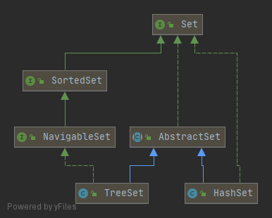

# Set


## AbstractSet
```java
public abstract class AbstractSet<E> extends AbstractCollection<E> implements Set<E> {

    protected AbstractSet() {
    }

    public boolean equals(Object o) {
        if (o == this)
            return true;

        if (!(o instanceof Set))
            return false;
        Collection<?> c = (Collection<?>) o;
        if (c.size() != size())
            return false;
        try {
            return containsAll(c);
        } catch (ClassCastException | NullPointerException unused) {
            return false;
        }
    }

    public int hashCode() {
        int h = 0;
        Iterator<E> i = iterator();
        while (i.hasNext()) {
            E obj = i.next();
            if (obj != null)
                h += obj.hashCode();
        }
        return h;
    }

    public boolean removeAll(Collection<?> c) {
        Objects.requireNonNull(c);
        boolean modified = false;

        if (size() > c.size()) {
            for (Object e : c)
                modified |= remove(e);
        } else {
            for (Iterator<?> i = iterator(); i.hasNext(); ) {
                if (c.contains(i.next())) {
                    i.remove();
                    modified = true;
                }
            }
        }
        return modified;
    }

}

```

## TreeSet
```java
public class TreeSet<E> extends AbstractSet<E>
    implements NavigableSet<E>, Cloneable, java.io.Serializable
{

    private transient NavigableMap<E,Object> m;

    private static final Object PRESENT = new Object();

    TreeSet(NavigableMap<E,Object> m) {
        this.m = m;
    }

    public TreeSet() {
        this(new TreeMap<>());
    }

    public TreeSet(Comparator<? super E> comparator) {
        this(new TreeMap<>(comparator));
    }

    public TreeSet(Collection<? extends E> c) {
        this();
        addAll(c);
    }

    public TreeSet(SortedSet<E> s) {
        this(s.comparator());
        addAll(s);
    }

    public Iterator<E> iterator() {
        return m.navigableKeySet().iterator();
    }

    public Iterator<E> descendingIterator() {
        return m.descendingKeySet().iterator();
    }

    public NavigableSet<E> descendingSet() {
        return new TreeSet<>(m.descendingMap());
    }

    public int size() {
        return m.size();
    }

    public boolean isEmpty() {
        return m.isEmpty();
    }

    public boolean contains(Object o) {
        return m.containsKey(o);
    }

    public boolean add(E e) {
        return m.put(e, PRESENT)==null;
    }

    public boolean remove(Object o) {
        return m.remove(o)==PRESENT;
    }

    public void clear() {
        m.clear();
    }

    public  boolean addAll(Collection<? extends E> c) {
        // Use linear-time version if applicable
        if (m.size()==0 && c.size() > 0 &&
            c instanceof SortedSet &&
            m instanceof TreeMap) {
            SortedSet<? extends E> set = (SortedSet<? extends E>) c;
            TreeMap<E,Object> map = (TreeMap<E, Object>) m;
            Comparator<?> cc = set.comparator();
            Comparator<? super E> mc = map.comparator();
            if (cc==mc || (cc != null && cc.equals(mc))) {
                map.addAllForTreeSet(set, PRESENT);
                return true;
            }
        }
        return super.addAll(c);
    }

    public NavigableSet<E> subSet(E fromElement, boolean fromInclusive,
                                  E toElement,   boolean toInclusive) {
        return new TreeSet<>(m.subMap(fromElement, fromInclusive,
                                       toElement,   toInclusive));
    }

    public NavigableSet<E> headSet(E toElement, boolean inclusive) {
        return new TreeSet<>(m.headMap(toElement, inclusive));
    }

    public NavigableSet<E> tailSet(E fromElement, boolean inclusive) {
        return new TreeSet<>(m.tailMap(fromElement, inclusive));
    }

    public SortedSet<E> subSet(E fromElement, E toElement) {
        return subSet(fromElement, true, toElement, false);
    }

    public SortedSet<E> headSet(E toElement) {
        return headSet(toElement, false);
    }

    public SortedSet<E> tailSet(E fromElement) {
        return tailSet(fromElement, true);
    }

    public Comparator<? super E> comparator() {
        return m.comparator();
    }

    public E first() {
        return m.firstKey();
    }

    public E last() {
        return m.lastKey();
    }

    public E lower(E e) {
        return m.lowerKey(e);
    }

    public E floor(E e) {
        return m.floorKey(e);
    }

    public E ceiling(E e) {
        return m.ceilingKey(e);
    }

    public E higher(E e) {
        return m.higherKey(e);
    }

    public E pollFirst() {
        Map.Entry<E,?> e = m.pollFirstEntry();
        return (e == null) ? null : e.getKey();
    }

    public E pollLast() {
        Map.Entry<E,?> e = m.pollLastEntry();
        return (e == null) ? null : e.getKey();
    }

    @SuppressWarnings("unchecked")
    public Object clone() {
        TreeSet<E> clone;
        try {
            clone = (TreeSet<E>) super.clone();
        } catch (CloneNotSupportedException e) {
            throw new InternalError(e);
        }

        clone.m = new TreeMap<>(m);
        return clone;
    }

    private void writeObject(java.io.ObjectOutputStream s)
        throws java.io.IOException {
        // Write out any hidden stuff
        s.defaultWriteObject();

        // Write out Comparator
        s.writeObject(m.comparator());

        // Write out size
        s.writeInt(m.size());

        // Write out all elements in the proper order.
        for (E e : m.keySet())
            s.writeObject(e);
    }

    private void readObject(java.io.ObjectInputStream s)
        throws java.io.IOException, ClassNotFoundException {
        // Read in any hidden stuff
        s.defaultReadObject();

        // Read in Comparator
        @SuppressWarnings("unchecked")
            Comparator<? super E> c = (Comparator<? super E>) s.readObject();

        // Create backing TreeMap
        TreeMap<E,Object> tm = new TreeMap<>(c);
        m = tm;

        // Read in size
        int size = s.readInt();

        tm.readTreeSet(size, s, PRESENT);
    }

    public Spliterator<E> spliterator() {
        return TreeMap.keySpliteratorFor(m);
    }

    private static final long serialVersionUID = -2479143000061671589L;
}

```

## HashSet
```java
public class HashSet<E>
    extends AbstractSet<E>
    implements Set<E>, Cloneable, java.io.Serializable
{
    static final long serialVersionUID = -5024744406713321676L;

    private transient HashMap<E,Object> map;

    private static final Object PRESENT = new Object();

    public HashSet() {
        map = new HashMap<>();
    }

    public HashSet(Collection<? extends E> c) {
        map = new HashMap<>(Math.max((int) (c.size()/.75f) + 1, 16));
        addAll(c);
    }

    public HashSet(int initialCapacity, float loadFactor) {
        map = new HashMap<>(initialCapacity, loadFactor);
    }

    public HashSet(int initialCapacity) {
        map = new HashMap<>(initialCapacity);
    }

    HashSet(int initialCapacity, float loadFactor, boolean dummy) {
        map = new LinkedHashMap<>(initialCapacity, loadFactor);
    }

    public Iterator<E> iterator() {
        return map.keySet().iterator();
    }

    public int size() {
        return map.size();
    }

    public boolean isEmpty() {
        return map.isEmpty();
    }

    public boolean contains(Object o) {
        return map.containsKey(o);
    }

    public boolean add(E e) {
        return map.put(e, PRESENT)==null;
    }

    public boolean remove(Object o) {
        return map.remove(o)==PRESENT;
    }

    public void clear() {
        map.clear();
    }

    @SuppressWarnings("unchecked")
    public Object clone() {
        try {
            HashSet<E> newSet = (HashSet<E>) super.clone();
            newSet.map = (HashMap<E, Object>) map.clone();
            return newSet;
        } catch (CloneNotSupportedException e) {
            throw new InternalError(e);
        }
    }

    private void writeObject(java.io.ObjectOutputStream s)
        throws java.io.IOException {
        // Write out any hidden serialization magic
        s.defaultWriteObject();

        // Write out HashMap capacity and load factor
        s.writeInt(map.capacity());
        s.writeFloat(map.loadFactor());

        // Write out size
        s.writeInt(map.size());

        // Write out all elements in the proper order.
        for (E e : map.keySet())
            s.writeObject(e);
    }

    private void readObject(java.io.ObjectInputStream s)
        throws java.io.IOException, ClassNotFoundException {
        // Read in any hidden serialization magic
        s.defaultReadObject();

        // Read capacity and verify non-negative.
        int capacity = s.readInt();
        if (capacity < 0) {
            throw new InvalidObjectException("Illegal capacity: " +
                                             capacity);
        }

        // Read load factor and verify positive and non NaN.
        float loadFactor = s.readFloat();
        if (loadFactor <= 0 || Float.isNaN(loadFactor)) {
            throw new InvalidObjectException("Illegal load factor: " +
                                             loadFactor);
        }

        // Read size and verify non-negative.
        int size = s.readInt();
        if (size < 0) {
            throw new InvalidObjectException("Illegal size: " +
                                             size);
        }

        // Set the capacity according to the size and load factor ensuring that
        // the HashMap is at least 25% full but clamping to maximum capacity.
        capacity = (int) Math.min(size * Math.min(1 / loadFactor, 4.0f),
                HashMap.MAXIMUM_CAPACITY);

        // Constructing the backing map will lazily create an array when the first element is
        // added, so check it before construction. Call HashMap.tableSizeFor to compute the
        // actual allocation size. Check Map.Entry[].class since it's the nearest public type to
        // what is actually created.
        SharedSecrets.getJavaObjectInputStreamAccess()
                     .checkArray(s, Map.Entry[].class, HashMap.tableSizeFor(capacity));

        // Create backing HashMap
        map = (((HashSet<?>)this) instanceof LinkedHashSet ?
               new LinkedHashMap<>(capacity, loadFactor) :
               new HashMap<>(capacity, loadFactor));

        // Read in all elements in the proper order.
        for (int i=0; i<size; i++) {
            @SuppressWarnings("unchecked")
                E e = (E) s.readObject();
            map.put(e, PRESENT);
        }
    }

    public Spliterator<E> spliterator() {
        return new HashMap.KeySpliterator<>(map, 0, -1, 0, 0);
    }
}

```

## 对比TreeSet和HashSet
首先从源码上看，两者都是继承自AbstractSet，自然在默认的hashCode，removeAll，equals方法上是实现一致的  
其次，两者的实现均为依赖map存储元素，元素作为Key，默认的一个Object常量作为Value，只是前者基于TreeMap，后者基于HashMap
从实现接口来看，TreeSet实现`java.util.NavigableSet`，而`java.util.NavigableSet`继承自`java.util.SortedSet`，自然也就说明前者内部元素是有序,

navigableSet接口介绍
```java
public interface NavigableSet<E> extends SortedSet<E> {
    //返回此 set 中严格小于给定元素的最大元素；如果不存在这样的元素，则返回 null。
    E lower(E e);
    //返回此 set 中小于等于给定元素的最大元素；如果不存在这样的元素，则返回 null。
    E floor(E e);
    //返回此 set 中大于等于给定元素的最小元素；如果不存在这样的元素，则返回 null。
    E ceiling(E e);
    //返回此 set 中严格大于给定元素的最小元素；如果不存在这样的元素，则返回 null。
    E higher(E e);
    //获取并移除第一个（最低）元素；如果此 set 为空，则返回 null。
    E pollFirst();
    //获取并移除最后一个（最高）元素；如果此 set 为空，则返回 null。
    E pollLast();
    //返回此 set 中所包含元素的逆序视图。
    NavigableSet<E> descendingSet();
    //以降序返回在此 set 的元素上进行迭代的迭代器。
    Iterator<E> descendingIterator();
    //返回此 set 的部分视图，其元素范围从 fromElement 到 toElement。
    NavigableSet<E> subSet(E fromElement, boolean fromInclusive,
                           E toElement,   boolean toInclusive);
    //返回此 set 的部分视图，其元素小于（或等于，如果 inclusive 为 true）toElement。
    NavigableSet<E> headSet(E toElement, boolean inclusive);
    //返回此 set 的部分视图，其元素大于（或等于，如果 inclusive 为 true）fromElement。
    NavigableSet<E> tailSet(E fromElement, boolean inclusive);
}
```

